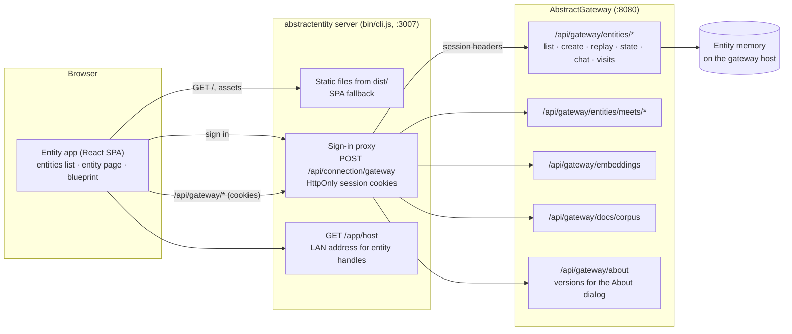
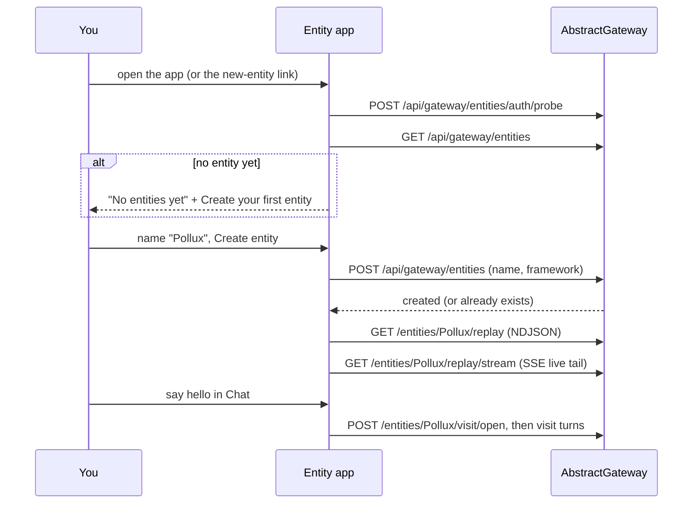
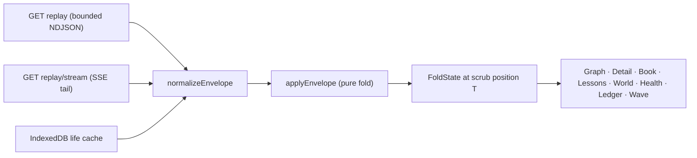

# Architecture

AbstractEntity is a static React single-page app plus a small Node server
(`bin/cli.js`). The server hosts the built app and the shared AbstractFramework
sign-in proxy (`@abstractframework/app-server`, `appId: "abstractentity"`). The
app keeps no server state of its own: everything it shows comes from
AbstractGateway's entity routes and from the memory engine's replay stream.

Read [Getting started](getting-started.md) first if you have not run the app yet.
The full list of routes and settings is in [API and configuration](api.md); how
data moves through each surface is in [Data flow](DataFlow.md).

## Components and connections



The browser talks only to the `abstractentity` server; the proxy swaps the
session cookies for gateway credentials. With `@abstractframework/app-server`
0.1.10 or newer, every request the proxy sends to the gateway also carries the
browser's own address (`X-Forwarded-For`, set from the connection and never
taken from the browser) and the marker
`X-AbstractFramework-App-Proxy: abstractentity`; see
[SECURITY.md](../SECURITY.md#session-model). A `?gateway=` link to a gateway on
another origin uses a direct posture instead: the app keeps the verified token
in memory for the tab and calls the gateway directly.

## Entity routes used by the app



All entity paths above sit under `/api/gateway`. The per-entity routes the app
reads or writes are listed in [API and configuration](api.md#gateway-routes-the-app-uses).

## The replay-stream fold

The memory engine writes an append-only replay stream of envelopes (form,
recall, commit, appraise, diary, valence, maintenance, plus gateway host
markers). The app folds this stream into its picture of a life:



The state at any position is the fold of every envelope up to it, so replay,
live tail and time scrub are one code path, and every tab agrees at any
position.

## Scope of this repository

This repository ships the Entity app. The services that make entities live
(entity homes, visit workflows, lifecycle phases, sleep and dreams, skills) run
in AbstractGateway, AbstractRuntime and AbstractMemory, and the app uses them
over HTTP. This repository also holds two shared specifications those services
read: the lifecycle phase graph ([`spec/entity_phases.json`](../spec/entity_phases.json),
explained in [The entity phase graph](entity-phases.md)) and the cognition map
behind the blueprint page ([`spec/cognition_graph.json`](../spec/cognition_graph.json)).

## App modules (`src/`)

| Area | Modules |
| --- | --- |
| Entry and shell | `main.tsx`, `entity_view.tsx`, `error_boundary.tsx`, `brand_mark.tsx`, `entity.css`, `entity_assistant.ts` (top-bar assistant over the gateway docs corpus), `app_about.ts` (About dialog: app version and gateway versions) |
| Entities list | `entities_index.tsx`, `roster_empty.ts` (empty state and `#new` deep link), `create_entity_form.tsx`, `fleet_view.tsx` (watch all), `entity_state.ts`, `index_page.ts` (`?page=blueprint` mapping) |
| Stream | `stream_types.ts`, `stream_source.ts` (gateway client, NDJSON/SSE), `stream_fold.ts` (pure fold), `replay_cache.ts` (IndexedDB life cache), `temporal_activation.ts` |
| Graph | `graph_canvas.tsx`, `graph_lenses.ts`, `force_layout.ts`, `topic_map.tsx` (topic communities), `node_label.ts` |
| Panels | `inspector.tsx`, `identity_card.tsx`, `timeline.tsx`, `ledger_panel.tsx`, `ledger_lines.ts`, `turn_detail_modal.tsx`, `verbatim_modal.tsx`, `phase_time.ts` |
| Reading surfaces | `book_reader.tsx`, `book_reader_select.ts`, `health_panel.tsx`, `health_metrics.ts`, `lessons_world_panels.tsx`, `cognitive_monitor.tsx` |
| Cognition wave | `utterance_harvest.ts`, `text_cache.ts`, `cognition_adapter.ts`, `cognition_wave_panel.tsx`, `cognition_wave_inline.tsx`, `vendor/cognition/` (scorer and basis vendored from AbstractUIC) |
| Visits (chat) | `chat_drawer.tsx`, `chat_message_list.tsx`, `use_flow_conversation.ts`, `flow_lane.ts`, `visit_status_poll.ts`, `turn_pulse.ts`, `turn_pulse_bars.tsx`, `tool_claim_guard.ts`, `tool_descriptor.ts`, `workspace_panel.tsx` (Settings), `substrate_picker.tsx` |
| Meets | `meet_console.tsx`, `meet_reader.tsx`, `entity_handle.ts` (`name@host` handles that offer a meet) |
| Blueprint | `blueprint_panel.tsx`, `blueprint_tunables.tsx`, `phase_map.tsx`, `phase_editor.tsx`, `edge_ops.ts`, `spec_sync.ts` |
| Sign-in | `connect_gateway_modal.tsx`, `gateway_session.ts` |

## Invariants

The test suite pins these:

- **State at T is a pure fold.** Replay, live tail and scrub share one code
  path; rendering only reads the fold.
- **Two id namespaces.** Bindings use graph ids, usage events use row ids; the
  fold joins them only on `display.graph_id`.
- **Diary redaction is never reconstructed.** The engine's
  `{"redacted":"diary"}` display block is the only source; a sealed entry's
  words never enter any view or feed.
- **Tool claims come from data, never prose.** Tool use renders from
  `tools_used` attributes and host events only.
- **Spatial memory is durable.** Graph layout anchors are persisted per entity,
  never derived from the camera.
- **Kind vocabulary stays in sync.** `ENGINE_RECORD_KINDS` mirrors
  `abstractmemory.MEMORY_RECORD_KINDS`; a drift test fails when a kind would
  render as unknown.
- **A malformed stream line never breaks the app.** `normalizeEnvelope` guards
  every ingest boundary and each envelope is folded under its own guard.
- **Embedding spaces are never crossed silently.** The cognition wave scores
  only with the entity's own embedder; a mismatch is refused with a message.

## Serving

```text
abstractentity (bin/cli.js, :3007)
  ├─ /                      the Entity app (SPA fallback for unknown paths)
  ├─ /entity.html           302 → /   (older bookmarks)
  ├─ /app/host              {"lan_ip": ...} for entity handles
  ├─ /api/connection/*      sign-in (HttpOnly session cookies)
  └─ /api/*                 proxied to the gateway with session headers
```

`npm run dev` mounts the same sign-in proxy in the Vite dev server, so sign-in
behaves the same in development and production.
