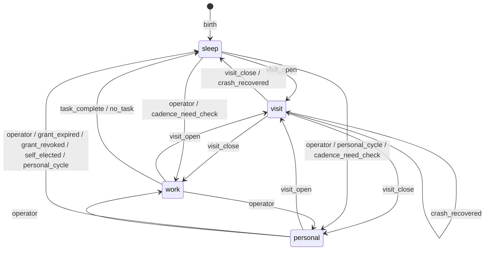

# The entity phase graph

This page explains the entity lifecycle in prose: the liveness axis, the four
phases and the rules between them. The machine-readable source is
[`spec/entity_phases.json`](../spec/entity_phases.json) (version 21), which the
gateway serves at `GET /api/gateway/entities/spec/phases` and the blueprint page
renders and edits. The JSON is authoritative: when this page and the JSON
differ, follow the JSON. Per-edge detail (edge ids, guards, edit policy, cause
evaluators and the graph-overlay contract) lives only in the JSON.

`abstractentity` owns the phase graph and the entity representation;
AbstractRuntime executes it and AbstractGateway serves it.

## The liveness axis (v2 — ALIVE | STOP)

Above the phase machine sits a two-value **liveness axis** (laurent 16:06):

- **alive** — the four phases operate normally. Sleep is alive: memory
  processes run, and a sleeping entity is *reachable* (visits auto-wake).
- **stop** — everything is blocked: no tick, no visit, no work, no sleep
  processes. Unreachable. **The primary kill switch** — a safeguard for a
  rogue entity, a hijack, or digital disease; protection, not punishment.

Stop is not a fifth phase and never joins the radio: it blocks the whole
machine. It is operator-only, principal-stamped, marker-first, and
structural at every door — no entity-reachable path may unset it. The
reconciliation with the engraved `paused` hard-freeze is semantics' ruling
(one kill switch, never two).

## The four phases

An entity is in **exactly one phase** at any instant (a radio, not toggles):

| Phase | Behavior | Entered by |
| --- | --- | --- |
| **visit** | Turn-based: a visitor is in the room; he waits between turns | A visitor opening (auto-wake ruled; no button-entry) |
| **work** | Fully autonomous on given tasks until completion | A task being given (entry doors in build) |
| **personal** *(spoken synonym: own-time)* | Free exploration on his own tick: interests, questions, research, his own identity and cognition | Operator arm + start (grant-gated, off by default) |
| **sleep** | Passive memory-graph processes: consolidation, dreams | Sleep control; work completion; no-task; grant expiry; **birth** |

Three separate truths, never mixed into one enum:

- **phase** — current activity (this graph),
- **state** — awake / asleep / paused (intent),
- **grant** — `phases.personal` armed (standing permission). **Armed ≠ in-phase.**

## The graph

Every transition in version 21, grouped by source and target phase (labels are
the transition causes):

## Invariants (each one is test-pinnable; the JSON carries the full text)

1. One active phase; exclusivity absolute.
2. Visit-close **restores the previous phase** (recorded at open; personal
   restores only through a still-armed grant, else sleep).
3. A visit **ends** the prior phase — never suspends it; restore is re-entry.
4. Personal is grant-gated, off by default; process-existence is never
   permission.
5. Newborn entities begin asleep.
6. One transition marker: `phase_changed {old, new, cause, principal?}`,
   phase KEYS (`visit`, not `visiting`), closed cause set, ONE writer.
7. UI: radio semantics (`role=radiogroup/radio`, `aria-checked`), one primary
   label per control, "current phase" wording.
8. **AWAKE-NEVER-RENDERS (v6, laurent c203 2026-07-20)**: no surface renders
   "awake" as a phase, chip, pill or dwelling state. Unphased-alive renders
   as the **settling transition** toward the idle default (sleep) — the
   entity app shows `sleep (settling)`. The word "awake" survives only as
   state-axis machine vocabulary (wake verbs, wire fields), never as display.
9. **DRIVES-ARE-DRIVERS (v7, laurent dm#82 — supersedes DRIVES-FORBID-IDLE)**:
   standing questions, problems, commitments, ideas, interests and tensions
   are the **drivers of cognition and existence** — a day arises because
   something pulls, never because a threshold forbids stillness. The
   mechanical split (both design adversaries folded): the **GATE** (whether
   a day arises) consumes *standing* drives — any open drive + an armed
   grant lets days arise; a settled desk sleeps. The **OFFER** (which drive
   surfaces in the day cue) consumes *aliveness*
   (`abstractmemory.alive_drives`: trail + formation recency — the evolving
   memory state), as act-frame handles with the release clause in the cue
   text, never a ranked agenda. Presence in a cue deposits nothing
   (presence ≠ use, pinned both ends). The **>20 floor** is observability
   only (`pressure_floor` block, ONE source
   `abstractmemory.DRIVE_PRESSURE_BOUND`) — the honest alarm is divergence
   (pressure high AND no day arising), never a level trigger: a healthy
   driven entity stands above 20 permanently. Runtime's gate machinery is
   tracked as an open question until it ships (the v6-era loop has no
   drive consult at all — armed means personal unconditionally).

10. **Day rulings (v8, laurent dm#89 2026-07-20)**: (a) **auto-personal
    yes** — inside a running loop with an armed grant, the day boundary may
    open a personal day; personal is *freedom* ("free to do what it needs,
    what he wants", sandbox execution included; rm outside the workspace and
    git write/reset forbidden). (b) **Unattended sleep wakes every ~6h** —
    an unarmed, taskless sleep is bounded at 6h (personal-entered sleeps
    keep the v5 ~1h bound); the wake is a need-check and a quiet desk
    re-sleeps without summoning. Sleep's purpose, his words: memory clean
    and functional + surfacing new drives to investigate while awake
    ("awake = personal or work time" — his own confirmation of the
    state/phase split). (c) **Work is always granted by default** when not
    sleeping and not visiting — a task alone starts a work day; only
    personal requires the grant. Also folded in v8: the machine-readable
    `state_mode_axis` block (role enum: decides/decorates/between-days),
    `own_time` as a personal spoken synonym, and the guarded-restore
    precision (the visit-close restore undoes only the visit's own
    displacement; an operator write mid-visit is the authority).

Two v5 rulings this page previously omitted (the JSON carried them; this
twin lagged — the gap was the bug):

- **Sleep is bounded (v5, laurent 2026-07-15 22:38)**: sleep is for a
  limited time (~1h bound); an explicit `wake_at` on the state write wins;
  `paused` never auto-clears (the kill switch).
- **Tasks request work (v5, laurent c2596)**: a task left with the entity
  is a **work-phase request** — the work-entry door and its cause word are
  pending (see open questions).

## Open questions (honest holes, awaiting rulings)

- **Awake-idle** — RESOLVED (v4, laurent 2026-07-15): the machine has **no
  awake-idle node**. Awake is a STATE, never a phase. An alive+awake entity
  is always in a phase — unphased-alive resolves at once: **tasks pending →
  work, no tasks → sleep** (idle *is* sleep). Tasks arrive **through a
  visit** (which auto-wakes); at visit close the entity enters **work** to
  complete them and returns to **sleep** when none remain. **Personal** is
  an operator request: from **work** it sends a confirmation notification
  and interrupts the task; from **sleep** it needs no confirmation. Any
  surviving "awake, no phase" render is an unresolved transition or a
  phase-instrumentation coverage gap (the runtime doesn't yet auto-sleep on
  idle) — never a legitimate phase. **v6 closes the display side**: that
  unresolved read now renders as settling-toward-sleep, never the word
  "awake" (invariant 8). (superseded note below kept for history)

- **Awake-idle (v3, historical)**: the ruled machine has no idle node; today an entity can be
  awake with no phase current (post-stop). Surfaces render no position
  pushed with the honest word.
- **Work entry**: the entry door and its cause word are pending; the JSON
  reserves the slot.

## What an entity IS (representation note)

The entity is **its collection of memories and experiences** (laurent
14:09). The substrate (provider/model) is **a resource granted to live** —
necessary for cognition, never identity; it sits in the granted-resources
family beside the personal grant, state acts, tool grants and workspaces.
Every grant change is a durable event in the life's stream.

## Consuming this artifact (two halves, both binding)

- **Executors and tests** import the JSON directly — one source (runtime
  transition tests, gateway derivations, this repo's
  `src/phase_graph.test.ts` drift pins).
- **UI surfaces** consume gateway-**derived** wire payloads and render them
  verbatim — never import the artifact (derive-never-copy: drift is caught
  at one derivation point, and a spec version bump never forces lockstep UI
  releases).
