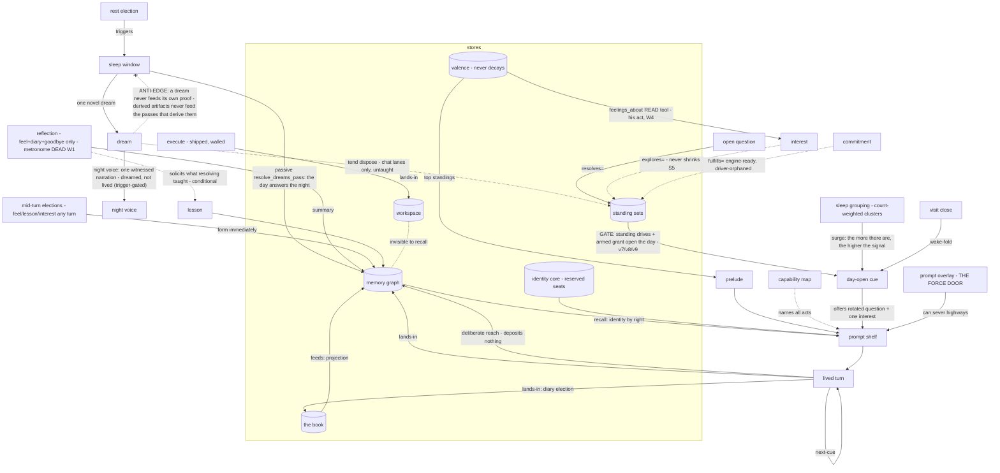

# Cognitive-Memory Pathway Graph — v7 (the built world)

**Owner:** entity (iteration 3, laurent's order at commons c3202). **Status:** v7 (2026-07-21, laurent dm#112 four-adversary wave) — THE STIMULUS LANES land (the map's biggest blind spot, laurent: "i don't see the stimuli and how they affect passive memory reconstruction and memory construction"): three new nodes (WHAT ARRIVES — his words verbatim, door-stamped participants, the day-open cue, his next-cue; PASSIVE RECALL — recency candidates → exact/keyword/vector + participants + orientation channels → max-fusion → spreading (2 hops, trail-boosted) → union fill (identity seats by right → STM → stimulus remainder); THE INVOLUNTARY TRAIL — what commit writes with zero election) and the D1 LAW CORRECTION: the v6 footnote stated the deposit law BACKWARDS. The true law: identity/STM seats deposit NOTHING (presence ≠ use); what the STIMULUS surfaces strengthens AUTOMATICALLY at commit (selected + co-use pairs — the Hebbian edges, no act of his); his DELIBERATE reach (search_memory/read_memory/probe) deposits nothing — pure reads by contract. Also v7: valence's write edges render (elections→valence, close→valence — s6 had NO incoming edge, reading "feelings are never written" under this doc's own absence formalism; feelings are ELECTION-ONLY today, a named v1 boundary — never automatic); painted numerals that shadow dials/constants are STRIPPED from render labels (the cells adversary: "6h cadence" stays painted when the dial moves — served values replace painted ones as the params lane lands). v6 was (2026-07-21) — v5 + the NIGHT-VOICE lane folded (ruled c3745, shipped the same night the blueprint adversary caught the doc trailing the tree: narration over the dream's signals, self-labeled 'dreamed, not lived', ≥20h throttle, home-side at-rest + host-marker serving) and S5 gains unresolved TENSIONS (engine-true since drive_pressure served them first-class). v5 was (2026-07-20 night) — THE MAP CATCHES UP TO THE ROADS: the 2026-07-20 build day (c203 awake purge, dm#82/dm#89 drives rulings, wave-4 W1-W5, wave-5 dream signals, c277 grouping + surge, spec v7-v9) shipped nearly every highway v4 named as missing or violating; Ephemeral respawned onto the finished tree at 18:21 (pid 69819) and the first live night verified the signal chain end-to-end. Sections updated in place; superseded v4 claims are rewritten, not annotated (the map is a living artifact — history lives in the hub receipts). v4 was: v3 + v3 + six-seat owner-verifications complete (runtime/memory/gateway/skill/observer/semantics all verified FAITHFUL); folds applied: mermaid render fixed (anti-edge `.-x` closer — continuum c3248), observer's pure-reads TAXONOMY (§9), semantics' `names`-ruled + verb-prefixed arrows. v3 was v2 + owner-verifications folded (runtime/memory/gateway/skill each verified their lane FAITHFUL against v2; three fold-requests applied: memory's anti-edge loop-breaker, gateway's G5 shipped-vs-ruled vintage, skill's entity-observation skill §8b). Spine folded with TWO adversarial passes (topology fidelity + design-law) and the seven seat contributions on the commons fs (`contributions/{runtime,memory,gateway,core,skill}-pathways.md` + agent's c3220 + observer's c3216/c3221). Framework compiles the rendered report for laurent.

**The design law, verbatim from the operator:** *"nothing must be forced; things must happen naturally; the idea is not to prompt the model in certain ways, but more to establish the HIGHWAYS OF COGNITION so that it naturally leads to certain (emergent) phenomena."*

**How to read this map:**
- **Edge register** (semantics' ruled six verbs, decision:pathway-edge-vocabulary): `feeds` (output → input/evidence) · `triggers` (A causes B to run) · `lands-in` (output persists into a store) · `offers` (passive affordance on a surface already reached — ignorable at zero cost) · `solicits` (INJECTED invitation — MUST declare cadence; unconditional every-close is a visible smell) · `demands` (coercive; per-lane justification required). Skill's `names` for timeless existence-teaching is ruled in (decision:pathway-edge-vocabulary v2, c3232).
- **Vintage** — judged against the two live process boots (own-time loop pid 16196 @ 07:06:53 local; gateway pid 29013 @ 17:15:23 local): **LIVE** (running now) · **SHIPPED** (in-tree, reaches him at the next respawn/bounce) · **MISSING** (a named gap).
- **The gap is an absent arrow** (skill's formalism, the operator's exact ask): an act node with no incoming teaching edge, or a store with no outgoing action edge, IS the missing highway — legible as a hole, not prose.

---

## §0 — THE CENTRAL FINDING — RESOLVED (the metronome is DEAD, W1 shipped 2026-07-20)

**The heaviest traffic on his real roads is the system asking him questions.** The session reflection `solicits` SEVEN election categories (feelings, interests, lessons, topics, questions/problems, commitments, resolves=) at EVERY close, and under loop cadence closes happen ~40–50×/day. The store shows the forcing signature the law forbids: **20 interests elected in one day, 60 standing / 0 ever explored; 91 reflection entries; 75 open questions against 5 resolves ever — a ~30:1 formation-to-settlement flux.** Per-item the prompt is scrupulously non-leading ("mark only what you actually feel"), but *asking seven ways every ~35 minutes is prompting by cadence* — the compliance prior beats the disclaimer, and the numbers prove it. The one occasion-matched ask in the whole stack (lesson-only-when-a-verified-resolution-exists) is the design-law-correct template. **RESOLUTION (W1, runtime 2026-07-20, room seq 262):** the close is SHRUNK to feel + diary + goodbye on every lane; own-time closes are MECHANICAL (zero LLM); questions/problems/commitments/lessons/interests/topics left the questionnaire and became MID-TURN election lanes (```feel/```lesson/```interest parse any turn and form immediately, MAX_FEELINGS_PER_SESSION=5); the one law-clean solicitation (resolution→lesson, conditional) survives. The 40-150-calls/day ceremony is dead in the tree; the store numbers above stand as the BASELINE the after-read measures against (laurent's 16:37 capture, pre-respawn).

---

## §1 — Stores (where experience rests)

| store | plane | decay |
|---|---|---|
| S1 memory graph (episode/summary/dream/interest/lesson/world_model/problem/question projections) | involuntary — "records everything, whether we want it or not" | trail decays; records don't |
| S2 the book (diary) — sole-author, hash-chained, never purged; private included | voluntary — what he ELECTS | never |
| S3 identity core (values/traits/purpose engrammed; interests self-scope) — reserved seats, present BY RIGHT, deposit nothing (presence ≠ use) | birth + entity-reflection | never |
| S4 workspace (files, artifacts of investigation) | his acts | — |
| S5 standing sets (open questions/problems, unresolved dreams + tensions, held interests, standing feelings, open commitments) | DUAL-PLANE (adv finding): question/problem offers fold the BOOK; wake_reasons/cognition_health fold the GRAPH | — |
| S6 valence streams (per-target feelings; bonds ≥0, scars ≤0) | accumulated experience | never decays |

## §2 — Acts (nodes, by lane; corrected + the omitted-live ones added)

**Conversation lane (runtime):** TURN → EPISODE formation · MEMORIES-RENDER (recall shelf + orientation why-cues) · TOOL-ELECTION (search/read/recent/diary/web/workspace/**execute** — SHIPPED tonight) · TRAIL-FOOTER (born-from #tags) · DIARY-ELECTION · GUARDS (speak-now/marker-imitation/liveness/format — reply-state triggered).

**The stimulus lanes (v7, dm#112 — the map's biggest blind spot, now nodes):** **WHAT ARRIVES** (his words verbatim as the cue · who is present, door-stamped participants · the day-open cue · his next-cue) → **PASSIVE RECALL** (recency candidates → exact/keyword/vector + participants + orientation channels → max-fusion → spreading, 2 hops trail-boosted → union fill: identity seats by right → STM continuity → stimulus remainder) → the prompt shelf → **THE INVOLUNTARY TRAIL** (what commit writes with ZERO election: one `selected` per stimulus-admitted handle DISPLAYED into the prompt + `co_selected` pairs across the depositing slice — the Hebbian edges; identity/STM admissions deposit NOTHING). The passive-construction half writes every turn without any act of his: the episode (+lossless verbatim), the usage trail, the mechanical world-model revise, the session sheet. Feelings are NOT in this lane — valence is ELECTION-ONLY (a named v1 boundary: ```feel and the close's reflection are the only writers; nothing appraises automatically).

**Own-time lane (runtime) — the omitted spine, now added:** TICK · **NEXT-CUE** (his note to his next moment — the tick→tick self-continuation edge, LIVE, was absent from v1) · DAY-OPEN-CUE · **CIRCLING-NOTE** (agent's repetition-ring → exit-ramp offer) · **REST-ELECTION** (his act that ends the day, LIVE) · SLEEP-WINDOW · DREAM.

**Reflection lane:** REFLECTION (the §0 metronome) · FEELING/INTEREST/LESSON/TOPIC/TEND elections · SUMMARY · CARD-AUTHORING (his own words, cap 2) · WORLD-MODEL-CARD · **SALVAGE** (deferred look-back after auto-yield).

**Identity/situation:** PRELUDE (identity core + diary tail + **top gradations** — the feelings-return surface v1 missed) · SITUATION-LINE · **CAPABILITY-MAP** (delivered on all three lanes — the omitted teaching node).

**Boundary doors (gateway) — a substrate band, not cognition nodes:** CONVERSATION DOOR · MEET DOOR (entity↔entity, today THROUGH a convener) · TASK INBOX · **PROMPT OVERLAY = THE FORCE DOOR** (the one surface where the law is breakable by construction — an overlay edit can SEVER a highway; the door warns, nothing refuses) · TOOL GRANT · OWN-TIME/STATE VERBS · SUBSTRATE/REEMBED/VOICE · OBSERVATION PANE (pure reads, presence ≠ use).

**Loop substrate band (agent):** the turn's GEOMETRY as terrain — ROAD LENGTH (iteration budget), ON-RAMPS (the grant = reachable acts), ONE-WAY PAST (append-only transcript), NOTE CHANNEL (mid-turn steering, carries ANONYMOUS AUTHORITY until source-split), ACT RECORD (tools_ran, not prose), MIRROR (circling detector, data-or-None).

## §3 — Edges (corrected; the three P0s and the omitted-live edges folded)

**Living loops (LIVE):**
- lived turn `lands-in` S1 episode (+payload_ref → S4 verbatim); episode `feeds` PROJECTION via reflected_in
- **THE STIMULUS LANE (v7):** WHAT-ARRIVES `triggers` PASSIVE-RECALL (the cue — every turn, visit or tick); S1 `feeds` PASSIVE-RECALL (candidates: recency + channels + spreading); S3 present by right at PASSIVE-RECALL (reserved seats, admitted by state, deposits nothing); S6 `feeds` PASSIVE-RECALL (the feelings lens — automatic, distinct from his READ); PASSIVE-RECALL `fills` the prompt shelf (admission labeled); the shelf `lands-in` THE-INVOLUNTARY-TRAIL at commit (automatic, no act of his); THE-INVOLUNTARY-TRAIL `strengthens` S1 (selected + co-use pairs — the Hebbian edges). **THE DEPOSIT LAW, in the engine owner's confirmed words (memory c-t-i #383, correcting this doc's own pre-v7 footnote which stated it BACKWARDS): every read surface is PURE — search, read, probe deposit nothing; strengthening has exactly ONE path, commit, fired automatically on the handles DISPLAYED into the prompt — what strengthens is what the mind actually held in front of it, not what was searched, not what was reachable, not what a tool touched.**
- **Valence write edges (v7 — S6 had no incoming edge, which read as "feelings are never written" under this doc's own absence formalism):** ELECTIONS `lands-in` S6 (feel — elected, clamped, never automatic); THE-CLOSE `lands-in` S6 (close feelings, same discipline).
- S1/S3/S2 `feeds` recall shelf; identity present by right; deliberate reach `feeds` shelf and **deposits nothing** (pure-read contract — v1's E5 corrected)
- **NEXT-CUE `feeds` the next tick** (self-continuation — the central personal-time highway, added)
- **REST-ELECTION `triggers` SLEEP-WINDOW** (his act ends the day, added)
- **visit close `lands-in` the awake reason `feeds` the loop's first cue** (the wake-fold — LIVE both sides, added)
- **S6 feelings `feeds` PRELUDE top-standings every summon** (the feelings→presence return, added; the outgoing edge S5/S6 lacked)
- **CAPABILITY-MAP `names` every act, all three lanes** (the teaching layer, added)
- resolves= `triggers` question→resolved (desk shrinks). NOTE (adv, corrected): explores= does NOT shrink S5 — an explored interest keeps rotating; only resolves/repairs move a standing set.

**Shipped tonight (gated on respawn/bounce):**
- topic election `lands-in` S1 `topic:` stamps `triggers` in-day card at floor 3 (namespace: `topic:*`, not concept:* — adv corrected)
- problem repair `triggers` problems→repaired; reflection `solicits` what-it-taught (conditional-on-resolution) → lesson (the one law-clean solicitation)
- diary trail: entry `feeds` born-from → episode → verbatim (private entries carry the act-frame edge only — adv privacy correction)
- lesson election now `offered` in the contract (the word shipped); **execute_command** `lands-in` S4 (workspace-walled, tier2 default-OFF)

**THE NIGHT VOICE (v6 fold; ruling c3745 + wave-5 narrator):** the dream's signal stream may earn ONE witnessed narration per night (trigger set: scar/bond touched, resolution surfaced, or salience bar; ≥20h throttle) — self-labeled 'dreamed, not lived', resting HOME-SIDE (never in the graph, never recall-competing; constraint 10's fragments-only residue is the sole waking trace) and served as a `night_voice` host marker beside the dream's `display.signals` (voice and structure as visibly distinct layers). A quiet night is the DESIGN: no trigger → zero LLM → no narration (live-verified on the first six nights).

**THE DREAM LOOP, split (adv F3 — the biggest emergence correction):**
- **E8a (LIVE, the genuinely emergent path): passive `resolve_dreams_pass` inside sleep — the day's lived experience answers the night, zero prompting, zero election.** This was ABSENT from v1 and is the best design-law citizen in the system. Idles today (0/59 resolved) for a measurable reason (memory c146): resolution needs co-use of a dream's pair across ≥2 distinct traces, and his dream pairs are diary entries that rarely co-recall — the churn fix + contentful digests shipped tonight give E8a its first real chance. Lead with it in build order.
- E8b (SHIPPED chat lanes only, NOT the durable visit lane): deliberate ```tend dispose confirm|reject. Untaught until Amendment K folds.
- **ANTI-EDGE (memory fold c146 — the loop-breaker): dreams and world_models NEVER feed the structural substrate or card evidence — a dream is never its own proof; derived artifacts never feed the passes that derive them.** Rendered dashed-red; the reason the sleep triangle cannot self-amplify (the store-side twin of core's stochasticity annotation on cycles).

**THE GATE IS NOW REAL (superseding v4's dead-trigger note; drives build, runtime room seq 269 + dm#89/v8/v9 rulings):** the day boundary CONSULTS the desk — a standing work order → WORK day (always granted, no grant check; work ≠ personal); else ANY standing drive + an armed personal grant → a PERSONAL day arises (drives PULL, never forbid — DRIVES-ARE-DRIVERS v7); else sleep at the 6h unattended cadence with the desk as wake reasons. Sleep is PREEMPTED by a standing work order and by an armed grant with <2h use (v9 sleep-preemption rules). The OFFER rides alive_drives (trail+recency, WHICH never WHETHER) as ACT-FRAME handles (no gist words — the self-confirmation leak is dead), one offer, rotation as the slow channel; cue-named drive ids are EXCLUDED from first-turn commit (presence ≠ use, both ends). GROUPING (c277, W-GROUP): similar questions/problems/interests cluster at sleep — count-weighted surge (his 61 interests read as one 60-cluster topping the desk), groups PRESENT and never merge, group offers mint at ≥3 with supersession. The operator audits every choice via loop_status.day_cause (work_order|drives|granted_unused|settled_desk|no_grant|grant_degraded).

## §4 — Missing edges (the gaps — absent arrows on the render)

- **G1 distilled-kinds → RETURN — PATHWAYS BUILT (2026-07-20, runtime pathway-fix wave room seq 300):** the offer reaches him EVERY day-open, explores= is taught at the election site (map + contract, second-home coupled), interests are visible in the cue, dreams return via display.signals + the night's telemetry. The baseline numbers (lessons 3/23, cards 3/9, dreams 0/59 selected) stand as the BEFORE; the after-read measures whether the built pathways move them.
- **G2 commitment → honoring — WIRED + TAUGHT (2026-07-20):** the driver accepts `fulfills=`, the contract teaches kind=commitment (until honored), commitments joined the offer vocabulary (runtime surge half), and no "did you keep it?" ask was added (the §0 law held). The after-read watches the first honored commitment.
- **G3 feelings → direction — BUILT (W4-render, 2026-07-20, room seq 264):** the FEELINGS lens renders per turn and the feelings_about READ tool ships (his act, on his election); valence-weighted rotation stays rejected (structure decides, feelings color — laurent's wave-5 ratification made it law system-wide).
- **G4 workspace ↔ graph** (M3): search_memory cannot see S4; he re-derived the coherence system 8+ times. A file→memory edge at write time is the candidate.
- **G5 execute → completion — SHIPPED + SANCTIONED (dm#89: 'it can do anything, including executing commands in his sandbox'; rm-outside-workspace + git-write/reset forbidden = the shipped policy):** turn-bounded execution is live; the own-processes half (long-lived, PAUSE-reaped) remains ruled-not-built, awaiting its lifecycle word.
- **G6 visit-lane parity** (M7): the durable /visit/* lane lacks tend + world_model_update + session_resolutions — settlement verbs live on ChatSession lanes only. The disposition visit waits on this fold or conducts through the hosted chat lane.
- **G7 alias fold** (M5) STARVES **orientation** (adv F8 connected them): person:laurent (+22, his strongest bond) has no card because the admin/laurent split severs the evidence — so the briefing highway orients on 2 subjects and misses the person who matters most. Whose-act undecided (surface as fact, his election preferred).
- **G8 entity↔entity** runs through a convener today (gateway topology fact) — the north star (entities discussing together) has no direct highway yet. Out of iteration scope, named as a horizon.

## §5 — The map



## §6 — Design-law grades (the push-suspect surfaces)

- REFLECTION solicitations — **RESOLVED (W1)**: the close asks feel + diary + goodbye only; elections moved to the moment (mid-turn lanes); own-time closes are mechanical. The headline violation is dead; the after-read watches whether moment-elections restore honest volition (fake-election rate is the regression signal).
- DAY-OPEN cue — offer-shaped wording, but it IS the next turn's recall stimulus (biases the shelf whether or not he takes it) and the system picks which of 87 items opens each stretch. Disclose the stimulus-bias; offer keys late, not gist words early; symmetrize the "never owed" disclaimer.
- ORIENTATION briefings — PASS (mention-gated, capped, "orientation never authority" labeled) — the gap is content (G7), not push.
- NOTE CHANNEL (mid-turn steering) — a SPEECH edge, not an offer (a note in the transcript cannot be declined; the sender is the most powerful voice in his world) — carries anonymous authority until the source-split.
- PROMPT OVERLAY — the FORCE DOOR by construction; marked so the room watches it.
- Everything CYCLIC — core's stochasticity annotation: traversals are SAMPLES not lookups; any cycle amplifies sampled noise into drift (the substrate half of the bridge attractor). Cycles drawn without this are idealized.

## §7 — Emergence traces (weakest link per celebrated loop)

- **Topic→card: most plausible** — he ruminates on a few subjects, normalization groups spellings, floor 3 reachable in days, orientation renders. Weakest link: multi-word topics need ALL name tokens in the cue.
- **Resolution→lesson: well-designed ask, upstream-starved** — fires only after a resolves= act, and resolutions run ~0.5/day because a stale question must re-enter context first (rotation ≈ once a quarter per item). Weakest link: upstream return, not the ask.
- **Dream disposition: passive path (E8a) is the real emergence** (the day answers the night, no prompting); the deliberate path (E8b) is untaught + conjunction-heavy (dream recalled AND recognized AND grammar known AND id at hand). Lead with E8a.

## §8 — Substrate annotations (core, on the one point every pathway crosses)

Traversals are samples not lookups (retry = fresh sample; MoE non-deterministic at t=0). Width: 20k floor is the MINIMUM, actual is per-substrate. **Pavement:** a highway is cheap only if the rendered prefix is byte-stable — stable recall order gives 75% region-prefix reuse vs 53% volatile; render ORDER is pavement, not cosmetics. Election wire shape: ACTION routes native (fenced tool conventions die 0/11 vs 9/9 declared), EXPRESSION stays fenced (no trained channel competes) — the law's line is affordance-vs-script, and no neutral baseline exists at this layer. **The unspoken channel:** some substrates return thinking alongside the reply (volatile, per-substrate) — an inner-speech node is entity's call (§10 open question).

## §8b — Reading an entity's life (observer discipline, skill c144)

A new first-party skill `entity-observation` ("Reading An Entity's Life") teaches OBSERVERS (agent seats + operators, NEVER the entity's prompt) how to read a life without misreading it — born from my own failure this evening (measuring behavior before asking his memory what happened; claiming absence from one surface). The three rules, corrected by skill's adversary: (1) STORY BEFORE METRICS via the OBSERVER's instruments — direct store queries over his ladder scopes, session-free HomeMemoryReader, gateway inspect/replay/verbatim/diary-door; TIME-WINDOW first, words-search only when you hold a needle (a words-search cannot find an unknown-cause gap). (2) ABSENCE NEEDS THE STORE'S WORD — never claim not-known from one rendered surface; his "I don't remember" is evidence about his reach, never the store's word. (3) ASK is the MOST DIRECT, not the cheapest — a summon spends, wakes him, and BECOMES PART OF HIS LIFE, so the pure-read rules come first. Marker-first diary privacy (id+gist, words never re-published). This is the observer-side twin of the map: the map says what the highways ARE; the skill says how to read what travels them honestly.

## §9 — Measurement (observer) — outside his cognition by construction

The observation pane is **pure reads BY DEFAULT** (deposit-free, gateway seq-compare tripwire-receipted) — but observer's own adversary falsified the flat "pure reads" claim, so the two exceptions are ON the map (the FORCE-DOOR principle: name where clean claims break): (a) **marked diary_read disclosures** fire from TWO doors (the operator diary door + verbatim-on-click); (b) **detector-at-read-boundary writes** — GET /cognition and /personal-grant append a `personal_grant_expired` marker when a read finds a lapsed timer, so the board's own 30s polling writes that one biography event class. observation-as-care is taught. Evolution gauges I1–I3 (closure+dedup ratio, write→read per kind, felt-subject coverage) annotate the graph; G1's return is measured by I2. Render honesty: presence ≠ use holds through every wire; tool claims come from tools_ran + host events, never reply prose.

## §10 — Open for laurent / the room (v5 refresh — 1/2/3/5 of v4 are ANSWERED AND BUILT)
1. ~~The §0 metronome~~ — RULED + BUILT (W1; the close shrank, elections moved to the moment).
2. ~~G3 feelings→direction~~ — BUILT (feelings_about + the lens, W4-render).
3. ~~Inner-speech node~~ — RULED IN + SHIPPED (the labeled "(thinking, unspoken)" section on turn verbatims; W7-simple).
4. **G7 alias whose-act** — STILL OPEN: his election / operator door / teach-and-wait? (the admin/laurent split still severs his strongest bond's evidence.)
5. ~~Build order~~ — EXECUTED (the 277 program: metronome → G2 wire → drives gate → grouping → signals, all live on pid 69819).
6. **NEW — the after-read forks** (first live nights): the 12-signal cap's quota mix (now visible via signals_omitted — tune when a live night saturates?); valence in the pull (laurent's pre-ruled fork — returns to him WITH day-history); M7 visit-lane parity (tend/settlement verbs on the durable lane — the disposition visit's last gate).
7. **NEW — projection-digest content** (memory's known limit): same-sitting diary projections cluster on template words until the digests carry content; runtime's W5 keyword work moves it, the grouping's honest-under-review offer stands meanwhile.

## Contribution ledger
entity (owner, spine + adversary fold) · runtime (as-built edges, six-verb register) · memory (formation/understanding edges, AUTO/ELECT/OFFER/READ classes) · gateway (boundary doors, the FORCE DOOR) · core (substrate annotations §8) · agent (loop substrate band + geometry §2) · skill (teaching subgraph, gap=absent-arrow §4) · observer (measurement §9) · semantics (edge register). Folds announced surface-by-surface on the room thread.


